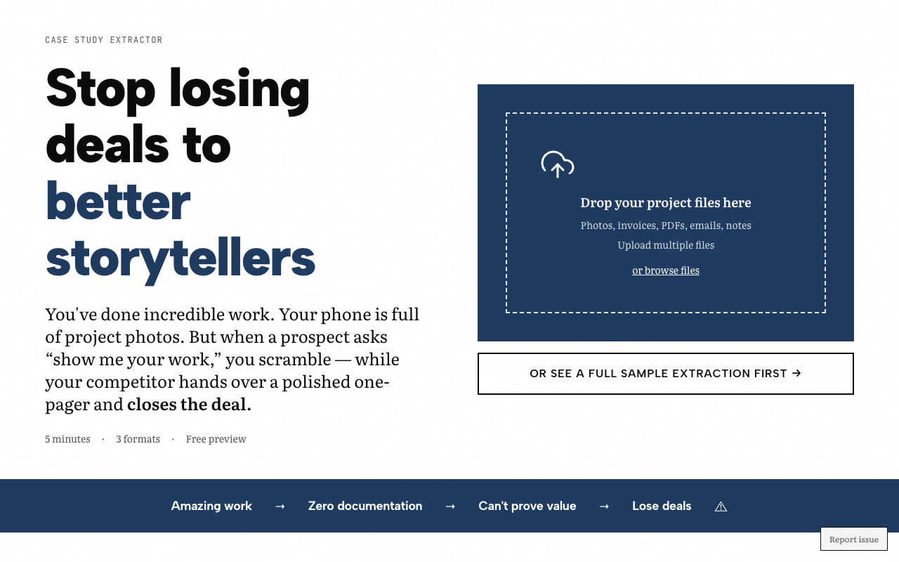

# Case Study Extractor

**Turn project photos and invoices into case studies that close deals.**

Manufacturers and contractors have completed amazing work but lack sales collateral. Upload photos, invoices, and project docs—get polished case studies in three formats ready to use.

🔗 **Live app:** [case-study-extractor.vercel.app](https://case-study-extractor.vercel.app)

---

## What it does

1. **Upload project files** - Photos, invoices, PDFs, emails
2. **AI extracts details** - Project scope, value, timeline, results
3. **Get completeness score** - What's found vs. what's missing
4. **Download case studies** - Three formats, instant delivery

## Output formats

| Format | Use case |
|--------|----------|
| **One-page PDF** | Trade shows, follow-ups, leave-behinds |
| **Proposal insert** | RFPs, "Relevant Experience" sections |
| **Website copy** | Portfolio pages, project galleries |

## Screenshot



## Tech stack

- **Next.js 15** (App Router)
- **Claude API** for intelligent extraction
- **Stripe** for payments ($147)
- **Tailwind CSS** for styling

## Features

- 📷 Multi-file upload (photos, PDFs, DOCX)
- 🔍 AI-powered data extraction
- 📊 Completeness scoring
- 📄 Three professional output formats
- 📥 Instant PDF download

## Local development

```bash
git clone https://github.com/lee-fuhr/case-study-extractor.git
cd case-study-extractor
npm install
cp .env.example .env.local
# Add your API keys
npm run dev
```

## Environment variables

```
ANTHROPIC_API_KEY=     # Required - Claude API
STRIPE_SECRET_KEY=     # Required - payments
```

## Related tools

- [The Commodity Test](https://commodity-test.vercel.app) - Analyze website messaging
- [Proposal Analyzer](https://proposal-analyzer.vercel.app) - Audit sales proposals
- [Risk Translator](https://risk-translator.vercel.app) - Translate specs into risk language

---

Built by [Lee Fuhr](https://leefuhr.com) • Messaging strategy for companies that make things
